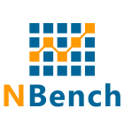

# NBench

Cross-platform performance benchmarking and testing framework for .NET applications.

NBench is designed for .NET developers who need to care about performance and want the ability to "unit test" their application's performance just like [XUnit](https://github.com/xunit/xunit) or [NUnit](http://nunit.org/) tests their application code.

## Build Status

| Stage             | Status                                                                                                                                                                                                                                   |
|-------------------|------------------------------------------------------------------------------------------------------------------------------------------------------------------------------------------------------------------------------------------|
| Windows Tests     |      |
| Integration Tests |  |
| NuGet Pack        |         |

## Documentation
To learn more, please read [the official NBench documentation](https://nbench.io).

Copyright (c) [Petabridge™, LLC](https://petabridge.com/) 2015-2020
